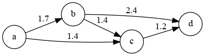

# Rapport

------------------------------------------

### SAE S2.02 -- Rapport pour la ressource Graphes


*Parlar Ryckewaert Desombre, groupe C*


#### Version 1 : un seul moyen de transport


### Présentation d'un exemple

#### Moyens de transport :   


| Départ | Arrivée | Mode de transport | Durée (min) | Prix (€) | Emissions (kg CO2e) |
|--------|---------|-------------------|-------------|----------|---------------------|
| A      | B       | Train             | 80          | 60       | 1.7                 |
| B      | D       | Train             | 40          | 22       | 2.4                 |
| A      | C       | Train             | 50          | 42       | 1.4                 |
| B      | C       | Train             | 60          | 14       | 1.4                 |
| C      | D       | Avion             | 22          | 110      | 150                 |
| C      | D       | Train             | 90          | 65       | 1.2                 |

<br>  

#### Utilisatrice :   

* Ville de départ : A
* Ville d'arrivée : D
* Mode de transport choisi : Train
* Critère d'optimisation : Minimisation des émissions de CO2
* Nombre d'itinéraires demandés : 3

<br>

#### Solution

**Les itinéraires possibles sont :**

1. **A-B-D (Train)**
   * Durée : 120 minutes (80 + 40)
   * Prix : 82 € (60 + 22)
   * Emissions : 4.1 kg CO2e (1.7 + 2.4)

<br>

2. **A-C-D (Train)**
   * Durée : 140 minutes (50 + 90)
   * Prix : 107 € (42 + 65)
   * Emissions : 2.6 kg CO2e (1.4 + 1.2)

<br>

3. **A-B-C-D (Train)**
   * Durée : 230 minutes (80 + 60 + 90)
   * Prix : 139 € (60 + 14 + 65)
   * Emissions : 4.3 kg CO2e (1.7 + 1.4 + 1.2)

<br>

* **On voit donc que l'itinairaire le plus optimisé est l'itinairaire A-C-D car c'est celuis qui génére le moin de CO2.**


### Modèle pour l'exemple

#### Graphe de l'exemple : 



Pour trouver le meilleurs itinéraire nous utilisons la commande :

`Grapp shortest-path -algorithm Dijkstra -on g2 -from a -silent -csv resultat-SAE.csv`

<br>

Ce qui nous renvoie : 

| Sommet       | a | b   | c   | d   |
|--------------|---|-----|-----|-----|
| Distance     | 0 | 1.7 | 1.4 | 2.6 |
| Prédécesseur |   | a   | a   | c   |

 * **Nous voyons donc que le chemin le plus rapide est A-C-D**

### Modélisation pour la Version 1 dans le cas général

<br>

- Les sommets du graphe représentent les diférentes ville. Chaque sommet est une entité distincte corespondant a une ville. Dans notre exemple les sommets sont A, B, C, D.   
- Les aréte représente les conextion direct entre les villes. Chaque aréte est associée à un mode de transport spécifique et a des carractéristiques comme la durée, le prix, et les émissions de CO2, c'est dailleur comme cela que sont définis les poids des arêtes.  
- Pour resoudre de probléme d'itinéraire, l'algorithme de Dijkstra est utilisé pour trouver le chemin le plus court dans un graphe podéré avec des point non négatif.  

### Implémentation de la Version 1

*Écrire une classe de test qui reprend l'exemple, définit toutes les données de la plateforme, construit le graphe et calcule la solution.*
*Votre classe peut utiliser des assertions (test unitaire) ou bien afficher la solution.*
*Donner ici le **nom complet de la classe**, **la date et l'identifiant du commit à regarder** et un **lien vers la page de cette classe sur gitlab qui correspond au bon commit***.

*On insiste sur l'importance de spécifier le commit. En effet, quand vous commencerez la Version 2, le code utilisé pour le test de la Version 1 sera modifié. Il se peut que vous n'ayez pas le temps de finaliser la Version 2 et vous retrouver avec un code qui ne marche pas même pour la Version 1. C'est pourquoi il est important de rédiger le rapport au fur et à mesure et de donner ici un lien vers la version de votre code qui marche pour la Version 1 du projet.*


Version 2 : multimodalité et prise en compte des correspondances
---

*Cette section explique la solution pour la Version 2 du projet.*

### Présentation d'un exemple

#### Moyens de transport :   


| Départ | Arrivée | Mode de transport | Durée (min) | Prix (€) | Emissions (kg CO2e) |
|--------|---------|-------------------|-------------|----------|---------------------|
| A      | B       | Train             | 80          | 60       | 1.7                 |
| B      | D       | Train             | 40          | 22       | 2.4                 |
| A      | C       | Train             | 50          | 42       | 1.4                 |
| B      | C       | Train             | 60          | 14       | 1.4                 |
| C      | D       | Avion             | 22          | 110      | 150                 |
| C      | D       | Train             | 90          | 65       | 1.2                 |

<br>  

#### Utilisatrice :   

* Ville de départ : A
* Ville d'arrivée : D
* Mode de transport choisi : Train
* Critère d'optimisation : Minimisation des émissions de CO2
* Nombre d'itinéraires demandés : 3

<br>

#### Solution

**Les itinéraires possibles sont :**

1. **A-B-D (Train)**
   * Durée : 120 minutes (80 + 40)
   * Prix : 82 € (60 + 22)
   * Emissions : 4.1 kg CO2e (1.7 + 2.4)

<br>

2. **A-C-D (Train)**
   * Durée : 140 minutes (50 + 90)
   * Prix : 107 € (42 + 65)
   * Emissions : 2.6 kg CO2e (1.4 + 1.2)

<br>

3. **A-B-C-D (Train)**
   * Durée : 230 minutes (80 + 60 + 90)
   * Prix : 139 € (60 + 14 + 65)
   * Emissions : 4.3 kg CO2e (1.7 + 1.4 + 1.2)

<br>

* **On voit donc que l'itinairaire le plus optimisé est l'itinairaire A-C-D car c'est celuis qui génére le moin de CO2.**


### Modèle pour l'exemple

#### Graphe de l'exemple : 


Pour trouver le meilleurs itinéraire nous utilisons la commande :

`Grapp shortest-path -algorithm Dijkstra -on g2 -from a -silent -csv resultat-SAE.csv`

<br>

Ce qui nous renvoie : 

| Sommet       | a | b   | c   | d   |
|--------------|---|-----|-----|-----|
| Distance     | 0 | 1.7 | 1.4 | 2.6 |
| Prédécesseur |   | a   | a   | c   |

 * **Nous voyons donc que le chemin le plus rapide est A-C-D**

### Modélisation pour la Version 1 dans le cas général

<br>

- Les sommets du graphe représentent les diférentes ville. Chaque sommet est une entité distincte corespondant a une ville. Dans notre exemple les sommets sont A, B, C, D.   
- Les aréte représente les conextion direct entre les villes. Chaque aréte est associée à un mode de transport spécifique et a des carractéristiques comme la durée, le prix, et les émissions de CO2, c'est dailleur comme cela que sont définis les poids des arêtes.  
- Pour resoudre de probléme d'itinéraire, l'algorithme de Dijkstra est utilisé pour trouver le chemin le plus court dans un graphe podéré avec des point non négatif.  

### Implémentation de la Version 2

*Écrire une classe de test qui reprend l'exemple, définit toutes les données de la plateforme, construit le graphe et calcule la solution.*
*Votre classe peut utiliser des assertions (test unitaire) ou bien afficher la solution.*
*Donner ici le **nom complet de la classe**, **la date et l'identifiant du commit à regarder** et un **lien vers la page de cette classe sur gitlab qui correspond au bon commit***.
*En particulier, il peut s'agir de la même classe que celle donnée pour la Version 1, mais un commit différent.*


Version 3 : optimisation multi-critères
---

### Présentation d'un exemple

#### Moyens de transport :   


| Départ | Arrivée | Mode de transport | Durée (min) | Prix (€) | Emissions (kg CO2e) |
|--------|---------|-------------------|-------------|----------|---------------------|
| A      | B       | Train             | 80          | 60       | 1.7                 |
| B      | D       | Train             | 40          | 22       | 2.4                 |
| A      | C       | Train             | 50          | 42       | 1.4                 |
| B      | C       | Train             | 60          | 14       | 1.4                 |
| C      | D       | Avion             | 22          | 110      | 150                 |
| C      | D       | Train             | 90          | 65       | 1.2                 |

<br>  

#### Utilisatrice :   

* Ville de départ : A
* Ville d'arrivée : D
* Mode de transport choisi : Train
* Critère d'optimisation : Minimisation des émissions de CO2
* Nombre d'itinéraires demandés : 3

<br>

#### Solution

**Les itinéraires possibles sont :**

1. **A-B-D (Train)**
   * Durée : 120 minutes (80 + 40)
   * Prix : 82 € (60 + 22)
   * Emissions : 4.1 kg CO2e (1.7 + 2.4)

<br>

2. **A-C-D (Train)**
   * Durée : 140 minutes (50 + 90)
   * Prix : 107 € (42 + 65)
   * Emissions : 2.6 kg CO2e (1.4 + 1.2)

<br>

3. **A-B-C-D (Train)**
   * Durée : 230 minutes (80 + 60 + 90)
   * Prix : 139 € (60 + 14 + 65)
   * Emissions : 4.3 kg CO2e (1.7 + 1.4 + 1.2)

<br>

* **On voit donc que l'itinairaire le plus optimisé est l'itinairaire A-C-D car c'est celuis qui génére le moin de CO2.**


### Modèle pour l'exemple

#### Graphe de l'exemple : 


Pour trouver le meilleurs itinéraire nous utilisons la commande :

`Grapp shortest-path -algorithm Dijkstra -on g2 -from a -silent -csv resultat-SAE.csv`

<br>

Ce qui nous renvoie : 

| Sommet       | a | b   | c   | d   |
|--------------|---|-----|-----|-----|
| Distance     | 0 | 1.7 | 1.4 | 2.6 |
| Prédécesseur |   | a   | a   | c   |

 * **Nous voyons donc que le chemin le plus rapide est A-C-D**

### Modélisation pour la Version 1 dans le cas général

<br>

- Les sommets du graphe représentent les diférentes ville. Chaque sommet est une entité distincte corespondant a une ville. Dans notre exemple les sommets sont A, B, C, D.   
- Les aréte représente les conextion direct entre les villes. Chaque aréte est associée à un mode de transport spécifique et a des carractéristiques comme la durée, le prix, et les émissions de CO2, c'est dailleur comme cela que sont définis les poids des arêtes.  
- Pour resoudre de probléme d'itinéraire, l'algorithme de Dijkstra est utilisé pour trouver le chemin le plus court dans un graphe podéré avec des point non négatif.  

### Implémentation de la Version 2

*Écrire une classe de test qui reprend l'exemple, définit toutes les données de la plateforme, construit le graphe et calcule la solution.*
*Votre classe peut utiliser des assertions (test unitaire) ou bien afficher la solution.*
*Donner ici le **nom complet de la classe**, **la date et l'identifiant du commit à regarder** et un **lien vers la page de cette classe sur gitlab qui correspond au bon commit***.
*En particulier, il peut s'agir de la même classe que celle donnée pour la Version 1, mais un commit différent.*

```mermaid
classDiagram
    class Lieu {
        <<interface>>
        +getNom() : String
    }

    class Ville {
        -String nom
        +Ville(String) : Ville
        +getNom() : String
        +toString() : String
    }

    class TypeCout {
        <<enumeration>>
        CO2
        TEMPS
        PRIX
    }

    class Troncon {
        <<interface>>
        +getDepart() : Lieu
        +getArrivee() : Lieu
        +getModalite() : ModaliteTransport
        +getCout() : Map~TypeCout, Double~
    }

    class Plateforme {
        -Set~Troncon~ troncons
        -Set~ Lieu~ lieux

        +Plateforme(Set~Troncon~ troncons,Set~ Lieu~ lieux)
        +Set~Troncon~ getTroncons()
        +getLieux()
        +setLieux(Set~Lieu~ lieux)
        +findIfPresent(Troncon source,Set~Troncon~ set)
        +filtrerTroncon(ModaliteTransport modalite)
        +getDataCSV(String filePath)
        +itinerairePossibleModailte(Lieu depart, Lieu arrivee, ModaliteTransport modalite)
        +calculItineraire(Lieu depart, Lieu arrivee,TypeCout cout, ModaliteTransport modalite)
        ...
    }

    class Voyageur {
        -String nom
        -TypeCout critereCout
        -ModaliteTransport critereModalite

        +Voyageur(String, TypeCout) : Voyageur
        +getNom() : String
        +getCritere() : TypeCout
    }

    class ModaliteTransport {
        <<enumeration>>
        TRAIN
        AVION
        BUS
        VELO
    }

    class Transport {
        -Lieu depart
        -Lieu arrivee
        -ModaliteTransport modalite
        -Map~TypeCout, Double~ cout
        +Transport(Lieu, Lieu, ModaliteTransport, Map~TypeCout, Double~) : Transport
        +getDepart() : Lieu
        +getArrivee() : Lieu
        +getModalite() : ModaliteTransport
        +getCout() : Map~TypeCout, Double~
    }

    Lieu <|.. Ville
    Plateforme --> Troncon : contains
    Voyageur --> TypeCout : contains
    Plateforme --> Lieu : contains
    Plateforme ..|> Comparable~TypeCout~
    Comparable <|-- TypeCout
    Transport ..|> Troncon
    Plateforme --> Voyageur : manages
    Transport --> Lieu : uses
    Transport --> ModaliteTransport : uses
    Transport --> TypeCout : contains
```'

----------------------------------------------------

